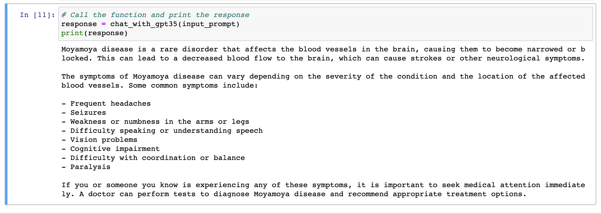

# GPT experiments on Jupyter/Colab noteooks
These are simple experiements to call OpenAI's [GPT APIs](https://platform.openai.com/docs/api-reference/introduction) via Python notebooks. 

The notebooks can be run on Jypter or on Google Colab. 

## Med GPT
The first notebook med_gpt_notebook walks through how to configure and use GPT APIs. Right now it is using `gpt-3.5-turbo` model but can be easily extended to use gpt-4 apis when they are released. 

We are using [ChatCompletion API](https://platform.openai.com/docs/api-reference/completions) for the demo, which takes a prompt and returns completions. 

We have designed the system to accept an input context(system context) in the config variable `DEFAULT_CONTEXT_MESSAGE` which allows for the GPT to respond with relevant the context. 

### Parameters to fine tune

We need to experiment with the responses of GPT by finetuning the parameters we pass to GPT. 

These primary parameters:
 - `MAX_TOKENS`
 - `TEMPERATURE`
 - `NUMBER_OF_CHOICES`

[]

### How to run
You can run this on Jupyter or Google Colab. 

`Using Jupyter on local / command line:`
- `$ jupyter notebook`
- navigate to med_gpt_notebook
- Replace `OPENAI_API_KEY ='##ADD_YOUR_KEY_HERE##'` with your OpenAPI key. If you don't have one - signup here: [platform.openai.com](https://platform.openai.com/)
- `Run`

You should see an output like this:

[]

Play with different prompts / context and have fun!